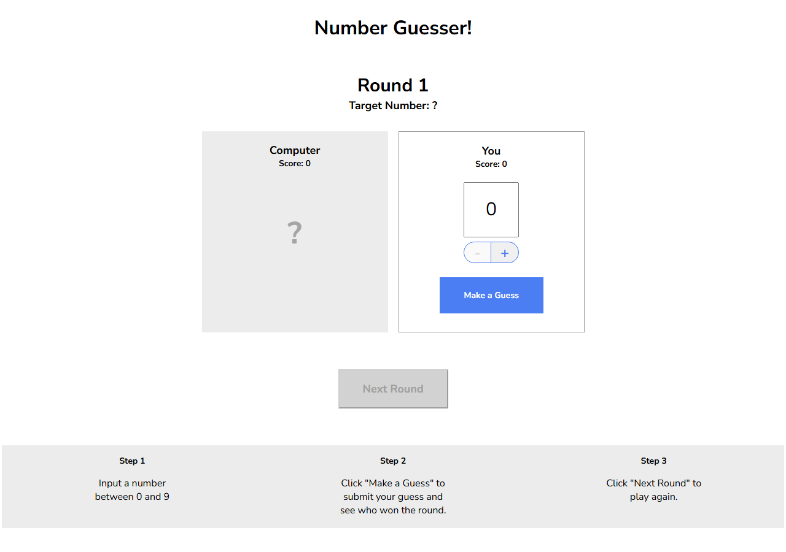

# Number Guesser

> Simple browser game where you compete against the computer guessing a number from 0 to 9.



---

## 🧩 Problem / Context

Codecademy practice project to apply DOM manipulation and event handling in vanilla JavaScript, with no frameworks or libraries.

---

## 🛠️ Stack

| Layer           | Technology       |
|-----------------|------------------|
| Frontend        | HTML, CSS, JavaScript (vanilla) |

---

## 🧠 Technical challenges and decisions

- **Problem:** deciding who wins the round when both players are equally close to the target number → **Solution:** ties go to the human (`compareGuesses` in [game.js](game.js)) → **Why:** favors the player so the game feels more rewarding.
- **Problem:** keeping the guess input within the 0-9 range → **Solution:** the `+`/`-` buttons are dynamically disabled based on the current value (`handleValueChange` in [script.js](script.js)).

---

## 🚀 How to run it

```bash
git clone https://github.com/Carlou134/Number-Guesser.git
cd Number-Guesser
```

Open `index.html` in your browser. No install or build required.
